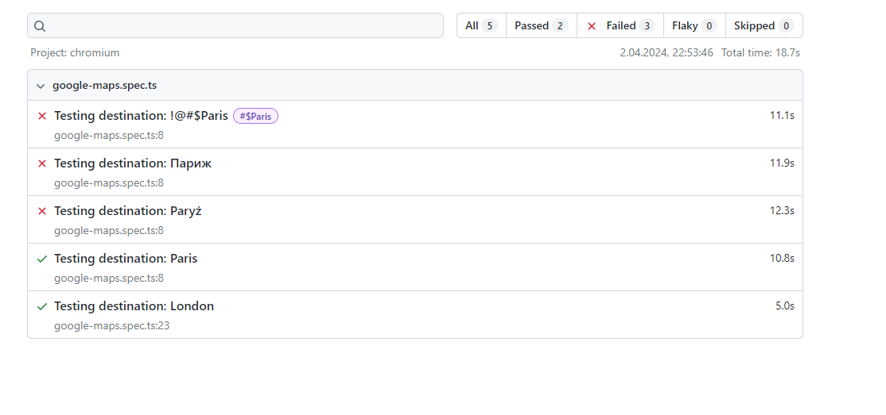
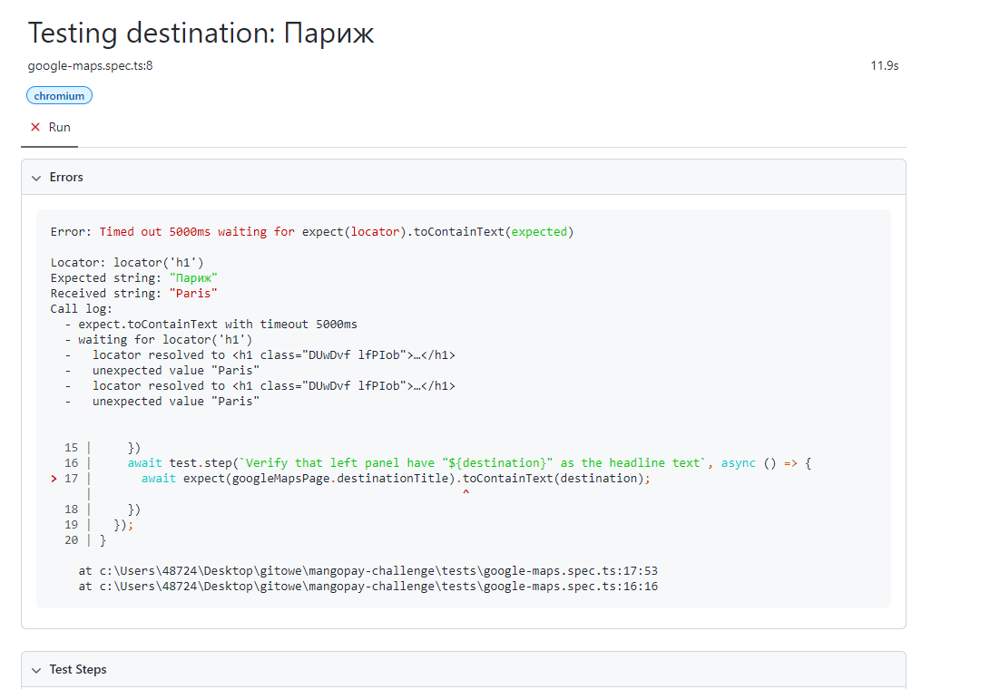

# mangopay-challenge
## What was already done to set it up?
 `npm init playwright@latest`

## How to run this code locally?

`npm install`

Run playwright tests from terminal: `npx playwright test`  
or   
Run playwright tests from terminal in UI Mode: `npx playwright test  --ui`

### Documentation used:

https://playwright.dev/docs/

### What has been covered so far?

- **4 Test Cases** to cover  Acceptance Criteria 1 (Paris) + unhappy paths, edge cases (other than eng, special char+direction, different alphabet)  
- **1 Test Case** to cover Acceptance Criteria 2 (London)  

## Current test results  
- Both tests covering acceptance criteria 1 & 2 should pass (Paris, London).
- Unhappy paths, edge cases - fails; based on user experience google maps application might works as expected. Referring only to acceptance criteria defined in Tech test - automated test cases were created in the way to pass only when string used in search box is equal to headline text.
Both acceptance criteria are written in the way that can be ambiguous. "Should have" phrase is imprecise and can be understand in different ways. That should be case for static testing e.g. should be capture and clarify during refinement meeting with business.

  

Generated report can be found in [playwright-report](playwright-report) directory.